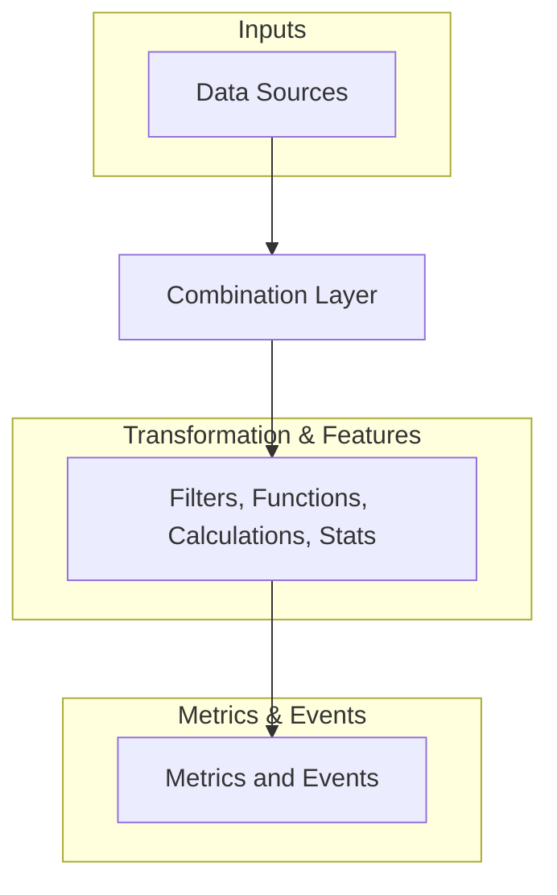

# Concept

## Top Level Concept Chart

## Target Functionality

### Inputs

- parquet s3
- timescaledb
- postgresdb / rest api (signal context)
- postgrest (business context)

### Combination 

- timeseries combination with signal context

----- HANDOVER FORMAT: DATAFRAME -----

### Transform

- filters - datatype specific filters
- functions - lamda functions (more general)
- time_functions 
- calculator

### Features

- stats - datatype specific stats
- time_stats - timestamp specific stats (last timestamp, first timestamp, occurence per hour, etc.)

### Events

- quality events - 
- maintenance events - 
- production events - 
- engineering events - 

### Metrics

- to be defined