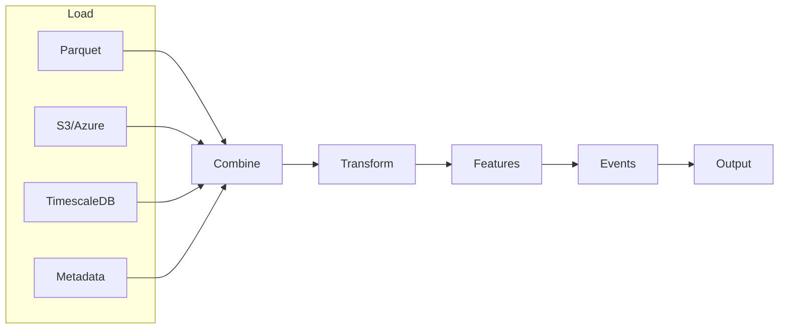

# Concept

ts-shape is a lightweight toolkit for shaping timeseries data into analysis-ready DataFrames.

## Architecture



## Core Principles

| Principle | Description |
|-----------|-------------|
| **DataFrame-First** | Every operation accepts and returns Pandas DataFrames |
| **Modular** | Use only what you need - all components are decoupled |
| **Composable** | Chain operations together like building blocks |
| **Consistent Schema** | Simple, predictable data structure |

## Data Model

### Timeseries DataFrame

| Column | Type | Description |
|--------|------|-------------|
| `uuid` | string | Signal/sensor identifier |
| `systime` | datetime | Timestamp (tz-aware recommended) |
| `value_double` | float | Numeric measurements |
| `value_integer` | int | Counter/integer values |
| `value_string` | string | Categorical data |
| `value_bool` | bool | Binary states |
| `is_delta` | bool | Delta vs absolute (optional) |

### Metadata DataFrame

| Column | Type | Description |
|--------|------|-------------|
| `uuid` | string | Signal identifier (join key) |
| `label` | string | Human-readable name |
| `unit` | string | Measurement unit |
| `config.*` | any | Additional configuration |

## Module Reference

### Loaders

| Module | Source | Method |
|--------|--------|--------|
| `ParquetLoader` | Local/remote parquet | `load_all_files()` |
| `S3ProxyParquetLoader` | S3-compatible storage | `fetch_data_as_dataframe()` |
| `AzureBlobLoader` | Azure Blob containers | `fetch_data_as_dataframe()` |
| `TimescaleLoader` | TimescaleDB | `fetch_data_as_dataframe()` |
| `MetadataLoader` | JSON files | `to_df()` |

### Transforms

| Module | Purpose |
|--------|---------|
| `NumericFilter` | Filter by numeric range, null handling |
| `StringFilter` | Pattern matching, contains, regex |
| `DateTimeFilter` | Time range, weekday, hour filters |
| `BooleanFilter` | Flag-based row filtering |
| `NumericCalc` | Derived columns, calculations |
| `TimezoneShift` | Convert between timezones |
| `TimestampConverter` | Parse/format timestamps |

### Features

| Module | Output |
|--------|--------|
| `NumericStatistics` | min, max, mean, std, percentiles |
| `TimestampStats` | first, last, count, coverage |
| `StringStatistics` | value counts, cardinality |
| `CycleExtractor` | Cycle detection and metrics |

### Events

| Module | Detection |
|--------|-----------|
| `OutlierDetection` | Z-score, IQR outliers |
| `StatisticalProcessControl` | SPC/control chart rules |
| `ToleranceDeviation` | Specification violations |
| `MachineStateEvents` | Run/idle state changes |
| `StartupEvents` | Startup detection |
| `SetpointEvents` | Setpoint changes |

## Pipeline Pattern

```python
# 1. LOAD
from ts_shape.loader.timeseries.parquet_loader import ParquetLoader
from ts_shape.loader.metadata.metadata_json_loader import MetadataLoader

ts_df = ParquetLoader.load_all_files("data/")
meta_df = MetadataLoader("config/signals.json").to_df()

# 2. COMBINE
from ts_shape.loader.combine.integrator import DataIntegratorHybrid

df = DataIntegratorHybrid.combine_data(
    timeseries_sources=[ts_df],
    metadata_sources=[meta_df],
    join_key="uuid"
)

# 3. TRANSFORM
from ts_shape.transform.filter.datetime_filter import DateTimeFilter
from ts_shape.transform.filter.numeric_filter import NumericFilter

df = DateTimeFilter.filter_after(df, "systime", "2024-01-01")
df = NumericFilter.filter_not_null(df, "value_double")

# 4. ANALYZE
from ts_shape.features.stats.numeric_stats import NumericStatistics
from ts_shape.events.quality.outlier_detection import OutlierDetection

stats = NumericStatistics(df, "value_double")
outliers = OutlierDetection.detect_zscore_outliers(df, "value_double", threshold=3.0)
```

## Design Decisions

### Why DataFrames?

- **Universal**: Understood by all data scientists
- **Ecosystem**: Works with matplotlib, scikit-learn, etc.
- **Debuggable**: Easy to inspect intermediate results
- **Exportable**: Save to CSV, parquet, database

### Why Modular?

- **Lightweight**: Import only what you need
- **Testable**: Each component works independently
- **Extensible**: Add custom modules easily
- **Maintainable**: Clear separation of concerns

### Why This Schema?

- **Flexible**: Not all columns required
- **Multi-type**: Handles numeric, string, boolean values
- **Joinable**: UUID enables metadata enrichment
- **Sparse-friendly**: Nulls are fine

## Extending ts-shape

### Custom Loader

```python
class MyDatabaseLoader:
    def __init__(self, connection: str):
        self.conn = connection

    def fetch_data_as_dataframe(self, start: str, end: str) -> pd.DataFrame:
        # Query database, return DataFrame with uuid, systime, value_*
        return df
```

### Custom Transform

```python
class MyFilter:
    @staticmethod
    def filter_business_hours(df: pd.DataFrame, column: str) -> pd.DataFrame:
        hours = pd.to_datetime(df[column]).dt.hour
        return df[(hours >= 9) & (hours < 17)]
```

### Custom Feature

```python
class MyMetrics:
    def __init__(self, df: pd.DataFrame, column: str):
        self.data = df[column].dropna()

    def coefficient_of_variation(self) -> float:
        return self.data.std() / self.data.mean()
```

## When to Use ts-shape

| Use Case | ts-shape? |
|----------|-----------|
| Load parquet/S3/Azure/DB into DataFrames | Yes |
| Filter and transform timeseries | Yes |
| Compute statistics on signals | Yes |
| Detect outliers and events | Yes |
| Real-time streaming | No (use Kafka/Flink) |
| Sub-millisecond latency | No (use specialized libs) |
| GPU acceleration | No (use cuDF/Rapids) |
