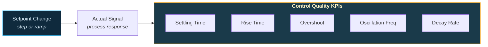

# Process Engineering

Setpoint change analysis with control quality KPIs and startup detection across machines. Built for process engineers optimizing thermal systems, drives, and continuous processes.

---

## Setpoint Change Analysis

Comprehensive setpoint change detection with control quality metrics.



### Detect setpoint changes

```python
from ts_shape.events.engineering.setpoint_events import SetpointChangeEvents

setpoint = SetpointChangeEvents(df, setpoint_uuid='temperature_setpoint')

# Detect step changes (discrete jumps)
steps = setpoint.detect_setpoint_steps(min_delta=5.0, min_hold='30s')

# Detect ramp changes (gradual increases)
ramps = setpoint.detect_setpoint_ramps(min_rate=0.1, min_duration='10s')
```

### Control quality KPIs

```python
# Time to settle within tolerance band
settling = setpoint.time_to_settle(
    actual_uuid='temperature_actual', tol=1.0, hold='10s', lookahead='5m'
)

# Rise time (10% to 90% of step)
rise = setpoint.rise_time(actual_uuid='temperature_actual')

# Overshoot / undershoot metrics
overshoot = setpoint.overshoot_metrics(actual_uuid='temperature_actual')

# All-in-one: settling, rise time, overshoot, oscillations, decay rate
quality = setpoint.control_quality_metrics(
    actual_uuid='temperature_actual', tol=1.0, hold='10s'
)
# Returns: t_settle, rise_time, overshoot, undershoot, oscillations, decay_rate
```

---

## Startup Detection

Detect machine startups across multiple signals and classify timing relative to planned shift start.

### Multi-machine startup analysis

A real-world pipeline: load data for multiple machines, detect heatup startups, and classify whether each started early, on time, or late.

#### Step 1 — Define machine registry

```python
import pandas as pd
from ts_shape.loader.timeseries.azure_blob_loader import AzureBlobParquetLoader
from ts_shape.transform.time_functions.timestamp_converter import TimestampConverter
from ts_shape.events.engineering.startup_events import StartupDetectionEvents

MACHINES = {
    "9cd63e77-36b4-...": {
        "name": "Curing Oven SO_17 - Temp",
        "threshold": 60.0,
        "hysteresis": (100.0, 30.0),
        "min_above": "90s",
        "shift_start": "06:00",
        "heatup_offset_min": 30,
    },
    "afe57364-05c3-...": {
        "name": "Curing Oven SO_17 - ConvSpeed",
        "threshold": 5.0,
        "hysteresis": None,
        "min_above": "60s",
        "shift_start": "06:00",
        "heatup_offset_min": 30,
    },
}
```

#### Step 2 — Load all signals

```python
loader = AzureBlobParquetLoader(
    connection_string="DefaultEndpointsProtocol=https;AccountName=...;AccountKey=...",
    container_name="timeseries",
    prefix="data",
)

df = loader.load_files_by_time_range_and_uuids(
    start_timestamp="2026-01-01 00:00",
    end_timestamp="2026-03-06 08:00",
    uuid_list=list(MACHINES.keys()),
)

df = TimestampConverter.convert_to_datetime(
    dataframe=df, columns=["systime"], timezone="Europe/Bucharest"
)
```

#### Step 3 — Detect and classify startups per machine

```python
results = []

for uuid, cfg in MACHINES.items():
    detector = StartupDetectionEvents(
        dataframe=df, target_uuid=uuid,
        value_column="value_double", time_column="systime",
    )

    events = detector.detect_startup_by_threshold(
        threshold=cfg["threshold"],
        hysteresis=cfg["hysteresis"],
        min_above=cfg["min_above"],
    )

    if events.empty:
        continue

    out = events[["start", "end"]].copy()
    out["machine"] = cfg["name"]
    out["date"] = pd.to_datetime(out["start"]).dt.date
    out["shift_start"] = pd.to_datetime(
        out["date"].astype(str) + " " + cfg["shift_start"]
    )
    offset = pd.Timedelta(minutes=cfg["heatup_offset_min"])
    out["diff_minutes"] = (
        (pd.to_datetime(out["start"]) - (out["shift_start"] - offset))
        .dt.total_seconds() / 60
    ).round(1)
    out["classification"] = pd.cut(
        out["diff_minutes"],
        bins=[-float("inf"), -5, 5, float("inf")],
        labels=["early", "on_time", "late"],
    )
    results.append(out)

df_all = pd.concat(results, ignore_index=True)
```

### Alternative detection methods

The same loop pattern works with any detection method — just swap the detection call.

```python
# Slope-based (for signals where absolute value varies)
events = detector.detect_startup_by_slope(min_slope=0.5, min_duration="20s")

# Adaptive (auto-adjusts from recent baseline)
events = detector.detect_startup_adaptive(
    baseline_window="1h", sensitivity=2.0, min_above="10s"
)

# Multi-signal (require speed AND temperature to rise together)
events = detector.detect_startup_multi_signal(
    signals={
        "speed_uuid": {"method": "threshold", "threshold": 5.0, "min_above": "60s"},
        "temp_uuid": {"method": "threshold", "threshold": 60.0, "min_above": "90s"},
    },
    logic="all",
    time_tolerance="30s",
)

# Startup quality assessment
quality = detector.assess_startup_quality(events)

# Failed startup detection
failed = detector.detect_failed_startups(
    threshold=60.0, min_rise_duration="5s",
    max_completion_time="5m", completion_threshold=120.0,
)

# Phase tracking (preheat → ramp → operating)
phases = detector.track_startup_phases(
    phases=[
        {"name": "preheat",   "condition": "threshold", "threshold": 40.0},
        {"name": "ramp_up",   "condition": "range",     "lower": 40.0, "upper": 100.0},
        {"name": "operating", "condition": "threshold", "threshold": 100.0},
    ],
    min_phase_duration="5s",
)
```

---

## Module Deep Dives

| Module | Description |
|--------|-------------|
| [Setpoint Events](../modules/engineering/setpoint-events.md) | Step/ramp detection, settling time, overshoot |
| [Startup Detection](../modules/engineering/startup-detection.md) | Threshold, slope, multi-signal, adaptive |
| [Threshold Monitoring](../modules/engineering/threshold-monitoring.md) | Multi-level thresholds with hysteresis |
| [Rate of Change](../modules/engineering/rate-of-change.md) | Rapid change and step jump detection |
| [Steady State Detection](../modules/engineering/steady-state.md) | Steady vs transient period segmentation |
| [Signal Comparison](../modules/engineering/signal-comparison.md) | Setpoint vs actual divergence |
| [Operating Range](../modules/engineering/operating-range.md) | Operating envelope and regime changes |
| [Warm-Up Analysis](../modules/engineering/warmup-analysis.md) | Thermal warm-up/cool-down curves |
| [Process Windows](../modules/engineering/process-windows.md) | Windowed statistics for shift monitoring |
| [Control Loop Health](../modules/engineering/control-loop-health.md) | PID loop health and oscillation |
| [Disturbance Recovery](../modules/engineering/disturbance-recovery.md) | Upset detection and recovery time |
| [Material Balance](../modules/engineering/material-balance.md) | Input/output balance checks |
| [Process Stability Index](../modules/engineering/process-stability.md) | Single 0-100 stability score |

---

## Next Steps

- [Production Monitoring](production.md) — Machine states and changeover detection
- [OEE & Plant Analytics](oee-analytics.md) — Startup delays feed into availability losses
- [API Reference](../reference/index.md) — Full engineering API documentation
