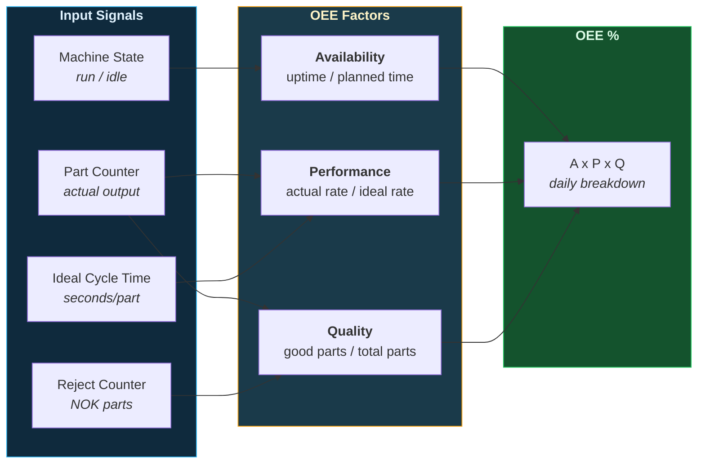
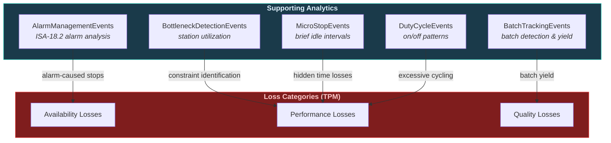

# OEE & Plant Analytics

Overall Equipment Effectiveness, alarm management, batch tracking, bottleneck detection, micro-stop analysis, and duty cycle monitoring. These classes provide the advanced analytics layer for plant-wide optimization.

---

## OEE Calculation Flow

OEE = Availability x Performance x Quality. Each factor is computed from a dedicated tracking class.



---

## OEE Calculator

Compute daily OEE from raw machine signals.

```python
from ts_shape.events.production.oee_calculator import OEECalculator

oee = OEECalculator(df)

# Individual factors
availability = oee.calculate_availability(
    run_state_uuid='machine_running', planned_time_hours=8.0
)

performance = oee.calculate_performance(
    counter_uuid='part_counter', ideal_cycle_time=30.0,
    run_state_uuid='machine_running'
)

quality = oee.calculate_quality(
    total_uuid='total_parts', reject_uuid='reject_parts'
)

# All-in-one daily OEE
daily_oee = oee.calculate_oee(
    run_state_uuid='machine_running',
    counter_uuid='part_counter',
    ideal_cycle_time=30.0,
    total_uuid='total_parts',
    reject_uuid='reject_parts',
    planned_time_hours=8.0
)
```

---

## Supporting Analytics

These classes feed into or complement OEE analysis — identifying the root causes behind availability, performance, and quality losses.



---

## Alarm Management

ISA-18.2 compliant alarm analysis — frequency, duration, chattering, and standing alarms.

```python
from ts_shape.events.production.alarm_management import AlarmManagementEvents

alarms = AlarmManagementEvents(df, alarm_uuid='temperature_high_alarm')

# Alarm activations per hour
frequency = alarms.alarm_frequency(window='1h')

# Duration statistics (min / avg / max / total)
durations = alarms.alarm_duration_stats()

# Chattering detection (>5 transitions in 10 minutes)
chattering = alarms.chattering_detection(min_transitions=5, window='10m')

# Standing alarms (active longer than 1 hour)
standing = alarms.standing_alarms(min_duration='1h')
```

---

## Batch Tracking

Detect batch boundaries, compute duration statistics, and calculate batch yield.

```python
from ts_shape.events.production.batch_tracking import BatchTrackingEvents

batches = BatchTrackingEvents(df, batch_uuid='batch_id_signal')

# Detect batch start/end from value changes
detected = batches.detect_batches()

# Duration statistics by batch type
stats = batches.batch_duration_stats()

# Production yield per batch
yield_df = batches.batch_yield(counter_uuid='part_counter')

# Transition matrix — which batch follows which
matrix = batches.batch_transition_matrix()
```

---

## Bottleneck Detection

Identify which station constrains the line, and track when the bottleneck shifts.

```python
from ts_shape.events.production.bottleneck_detection import BottleneckDetectionEvents

bottleneck = BottleneckDetectionEvents(df)

station_uuids = ['station_1_running', 'station_2_running', 'station_3_running']

# Per-station utilization percentage per hour
utilization = bottleneck.station_utilization(station_uuids, window='1h')

# Identify the bottleneck station per window
bn = bottleneck.detect_bottleneck(station_uuids, window='1h')

# Track when the bottleneck identity changes
shifting = bottleneck.shifting_bottleneck(station_uuids, window='1h')

# Summary statistics
summary = bottleneck.throughput_constraint_summary(station_uuids, window='1h')
```

---

## Micro-Stop Events

Find brief idle intervals that individually seem negligible but collectively reduce throughput.

```python
from ts_shape.events.production.micro_stop_detection import MicroStopEvents

micro = MicroStopEvents(df, run_state_uuid='machine_running')

# Find idle intervals shorter than 30 seconds
stops = micro.detect_micro_stops(max_duration='30s')

# Frequency per hour
frequency = micro.micro_stop_frequency(window='1h', max_duration='30s')

# Impact — time lost vs total available
impact = micro.micro_stop_impact(window='1h', max_duration='30s')

# Hourly patterns — find clustering times
patterns = micro.micro_stop_patterns(hour_grouping=True, max_duration='30s')
```

---

## Duty Cycle Events

Monitor on/off cycling patterns for pumps, valves, compressors, and other binary actuators.

```python
from ts_shape.events.production.duty_cycle import DutyCycleEvents

duty = DutyCycleEvents(df, signal_uuid='compressor_running')

# List every on/off interval with duration
intervals = duty.on_off_intervals()

# Duty cycle percentage per hour
pct = duty.duty_cycle_per_window(window='1h')

# Transition count per hour
count = duty.cycle_count(window='1h')

# Flag excessive cycling (>20 transitions/hour — may indicate control instability)
excessive = duty.excessive_cycling(max_transitions=20, window='1h')
```

---

## Module Deep Dives

**OEE & Advanced:** [OEE Calculator](../modules/production/oee-calculator.md) | [Alarm Management](../modules/production/alarm-management.md) | [Batch Tracking](../modules/production/batch-tracking.md) | [Bottleneck Detection](../modules/production/bottleneck-detection.md) | [Micro-Stop Detection](../modules/production/micro-stops.md) | [Duty Cycle](../modules/production/duty-cycle.md)

---

## Next Steps

- [Production Monitoring](production.md) — Machine states and shop floor tracking
- [Shift Reports & KPIs](reporting.md) — Performance loss, scrap, targets
- [Product Traceability](traceability.md) — Track parts through the process
- [API Reference](../reference/index.md) — Full OEE API documentation
