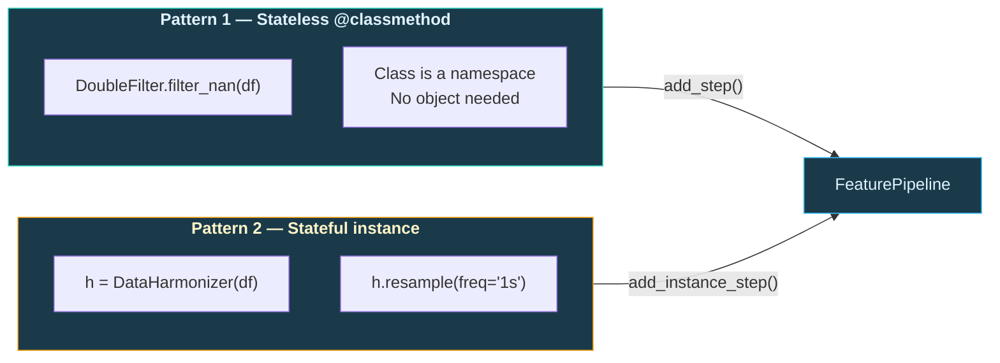
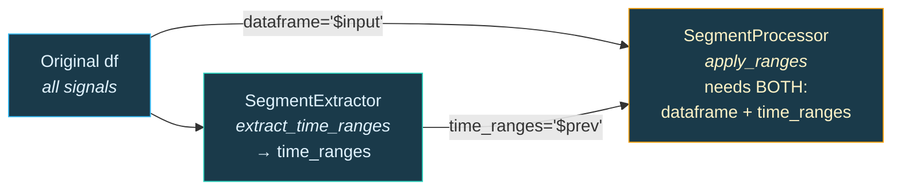
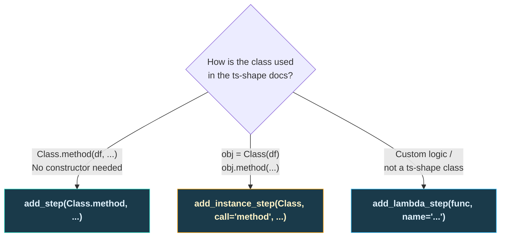

# Pipeline Builder

> Chain any ts-shape class into a reproducible, debuggable pipeline.

**Module:** `ts_shape.features.segment_analysis.feature_pipeline`
**Guide:** [Feature Extraction](feature-extraction.md)

---

## Why Use a Pipeline?

A typical ts-shape workflow chains 5–7 classes.  Written manually, intermediate variables pile up, debugging means inserting print statements, and a mistake in step 3 only surfaces when step 5 crashes with a confusing error.

`FeaturePipeline` solves this:

=== "Manual"

    ```python
    from ts_shape.transform.filter.numeric_filter import DoubleFilter
    from ts_shape.transform.filter.datetime_filter import DateTimeFilter
    from ts_shape.transform.harmonization import DataHarmonizer
    from ts_shape.features.segment_analysis.segment_extractor import SegmentExtractor
    from ts_shape.features.segment_analysis.segment_processor import SegmentProcessor
    from ts_shape.features.segment_analysis.time_windowed_features import TimeWindowedFeatureTable

    df = DateTimeFilter.filter_between_datetimes(
        df, start_datetime='2024-01-01', end_datetime='2024-01-31')
    df = DoubleFilter.filter_nan_value_double(df)
    harmonizer = DataHarmonizer(
        df, time_column='systime', uuid_column='uuid', value_column='value_double')
    df = harmonizer.resample_to_uniform(freq='1s')
    ranges = SegmentExtractor.extract_time_ranges(df, segment_uuid='order_number')
    segmented = SegmentProcessor.apply_ranges(
        df, time_ranges=ranges, target_uuids=['temperature', 'pressure'])
    features = TimeWindowedFeatureTable.compute(segmented, freq='1min')
    ```

=== "Pipeline"

    ```python
    from ts_shape.features.segment_analysis.feature_pipeline import FeaturePipeline
    from ts_shape.transform.filter.numeric_filter import DoubleFilter
    from ts_shape.transform.filter.datetime_filter import DateTimeFilter
    from ts_shape.transform.harmonization import DataHarmonizer
    from ts_shape.features.segment_analysis.segment_extractor import SegmentExtractor
    from ts_shape.features.segment_analysis.segment_processor import SegmentProcessor
    from ts_shape.features.segment_analysis.time_windowed_features import TimeWindowedFeatureTable

    features = (
        FeaturePipeline(df)
        .add_step(DateTimeFilter.filter_between_datetimes,
                  start_datetime='2024-01-01', end_datetime='2024-01-31')
        .add_step(DoubleFilter.filter_nan_value_double)
        .add_instance_step(DataHarmonizer, call='resample_to_uniform', freq='1s')
        .add_step(SegmentExtractor.extract_time_ranges,
                  segment_uuid='order_number')
        .add_step(SegmentProcessor.apply_ranges,
                  dataframe='$input', time_ranges='$prev',
                  target_uuids=['temperature', 'pressure'])
        .add_step(TimeWindowedFeatureTable.compute, freq='1min')
        .run()
    )
    ```

The pipeline version adds three capabilities for free:

- **Preview** — call `describe()` before running to see every step at a glance.
- **Intermediates** — call `run_steps()` to get a dict of DataFrames, one per step.
- **Error context** — if step 3 of 5 fails, the error message tells you which step, the DataFrame shape before it, and the available columns.

---

## The Two Class Patterns in ts-shape

ts-shape classes follow one of two patterns.  Choosing the right `add_*` method is the most important decision when building a pipeline.



| Pattern 1 — `add_step()` | Pattern 2 — `add_instance_step()` |
|---|---|
| `DoubleFilter`, `IntegerFilter`, `StringFilter`, `BooleanFilter`, `IsDeltaFilter`, `DateTimeFilter`, `CustomFilter` | `DataHarmonizer` |
| `IntegerCalc`, `LambdaProcessor` | `CrossSignalAnalytics` |
| `TimestampConverter`, `TimezoneShift` | `CycleExtractor` |
| `SegmentExtractor`, `SegmentProcessor`, `TimeWindowedFeatureTable`, `ProfileComparison` | `CycleDataProcessor` |
| `PatternRecognition` | `DescriptiveFeatures` |
| `NumericStatistics`, `BooleanStatistics`, `StringStatistics`, `TimestampStatistics`, `TimeGroupedStatistics` | `OEECalculator` |
| All 60+ event classes (`MachineStateEvents`, `OutlierDetectionEvents`, etc.) | |
| `ValueMapper` | |

!!! tip "Rule of thumb"
    If the docs show `Class.method(df)` — it's **Pattern 1**, use `add_step`.
    If the docs show `obj = Class(df); obj.method()` — it's **Pattern 2**, use `add_instance_step`.

    The pipeline catches mistakes: passing an instance method to `add_step` raises a `TypeError` with guidance on which method to use instead.

---

## Step Types

### `add_step` — Stateless classmethods (Pattern 1)

Use this for any `@classmethod` that takes a DataFrame as its first argument and returns a DataFrame.  The pipeline auto-injects the current DataFrame.

```python
# Example 1: Simple filter — no extra arguments
pipe.add_step(DoubleFilter.filter_nan_value_double)

# Example 2: Filter with parameters
pipe.add_step(DateTimeFilter.filter_between_datetimes,
              start_datetime='2024-01-01 06:00:00',
              end_datetime='2024-01-01 18:00:00')

# Example 3: Multi-DataFrame wiring with sentinels
pipe.add_step(SegmentProcessor.apply_ranges,
              dataframe='$input',       # use original data
              time_ranges='$prev',      # use output of previous step
              target_uuids=['temperature', 'pressure', 'speed'])
```

---

### `add_instance_step` — Stateful instance classes (Pattern 2)

Use this for classes that must be instantiated with a DataFrame before calling methods.

```python
# Example 1: Harmonizer — pivot to wide format
pipe.add_instance_step(DataHarmonizer, call='pivot_to_wide')

# Example 2: Harmonizer with method kwargs
pipe.add_instance_step(DataHarmonizer,
                       call='resample_to_uniform', freq='1s')

# Example 3: CycleExtractor with extra constructor args
pipe.add_instance_step(CycleExtractor,
                       call='process_persistent_cycle',
                       init_kwargs={'start_uuid': 'cycle_trigger'})
```

**What happens behind the scenes:**

When you write:

```python
pipe.add_instance_step(DataHarmonizer, call='resample_to_uniform', freq='1s')
```

The pipeline does this internally:

```python
# 1. Instantiate with the current DataFrame + column names from the constructor
instance = DataHarmonizer(
    dataframe=current_df,        # auto-injected
    time_column='systime',       # from FeaturePipeline constructor
    uuid_column='uuid',          # from FeaturePipeline constructor
    value_column='value_double', # from FeaturePipeline constructor
)

# 2. Call the method with your kwargs
result = instance.resample_to_uniform(freq='1s')
```

The pipeline inspects the class constructor and only passes column-name arguments it accepts.  Extra constructor arguments can be provided via `init_kwargs`.

---

### `add_lambda_step` — Custom functions (Pattern 3)

Use this for one-off transformations that don't map to a ts-shape class.

```python
# Example 1: Select specific UUIDs
pipe.add_lambda_step(
    lambda df: df[df['uuid'].isin(['temperature', 'pressure'])],
    name='select_signals',
)

# Example 2: Add a derived column
pipe.add_lambda_step(
    lambda df: df.assign(value_celsius=df['value_double'] - 273.15),
    name='kelvin_to_celsius',
)

# Example 3: Drop duplicates
pipe.add_lambda_step(
    lambda df: df.drop_duplicates(subset=['systime', 'uuid']),
    name='deduplicate',
)
```

!!! info "Always name your lambda steps"
    The `name` parameter makes `describe()` output and error messages much more readable.  Without it, the step shows as `<lambda>`.

---

## Wiring DataFrames with Sentinels

Most steps just pass the DataFrame forward: step 1 output becomes step 2 input.  But some steps need **two** DataFrames.  The classic example is segment extraction:



**`$prev`** resolves to the output of the previous step.  **`$input`** resolves to the original DataFrame passed to the `FeaturePipeline` constructor.

```python
pipe = (
    FeaturePipeline(df)    # df has all signals including 'order_number'

    # Step 1: Extract time ranges from the order signal
    .add_step(
        SegmentExtractor.extract_time_ranges,
        segment_uuid='order_number',
    )

    # Step 2: SegmentProcessor.apply_ranges needs TWO DataFrames:
    #   dataframe  = the raw process data  → '$input' (the original df)
    #   time_ranges = the ranges from step 1 → '$prev'
    .add_step(
        SegmentProcessor.apply_ranges,
        dataframe='$input',
        time_ranges='$prev',
        target_uuids=['temperature', 'pressure', 'speed'],
    )
    .run()
)
```

!!! warning "Sentinels are case-sensitive"
    `'$prev'` and `'$input'` are the **only** valid sentinels.  Typos like `'$PREV'`, `'$Prev'`, or `'$foo'` raise a `ValueError` immediately at registration time — not at runtime.

---

## Debugging

### `describe()` — Preview before running

Call `describe()` to see a summary of the pipeline without executing it:

```python
pipe = (
    FeaturePipeline(df)
    .add_step(DoubleFilter.filter_nan_value_double)
    .add_instance_step(DataHarmonizer, call='resample_to_uniform', freq='1s')
    .add_step(SegmentExtractor.extract_time_ranges, segment_uuid='order_number')
)

print(pipe.describe())
```

Output:

```
FeaturePipeline (1200 rows, 4 cols)
  1. [step    ] DoubleFilter.filter_nan_value_double
  2. [instance] DataHarmonizer.resample_to_uniform  freq='1s'
  3. [step    ] SegmentExtractor.extract_time_ranges  segment_uuid='order_number'
```

Each line shows the step number, type tag (`step` / `instance` / `func`), method name, and parameters.

---

### `run_steps()` — Inspect intermediates

When a step produces unexpected output, use `run_steps()` instead of `run()` to get every intermediate DataFrame:

```python
intermediates = pipe.run_steps()

for name, step_df in intermediates.items():
    print(f"{name:40s} → {step_df.shape}")
```

Output:

```
input                                    → (1200, 4)
DoubleFilter.filter_nan_value_double     → (900, 4)
DataHarmonizer.resample_to_uniform       → (900, 4)
SegmentExtractor.extract_time_ranges     → (3, 5)
```

You can then inspect any step: `intermediates['DoubleFilter.filter_nan_value_double'].head()`.

---

### Error messages — When things go wrong

If a step fails, the error includes the step number, name, DataFrame shape, and available columns:

```
RuntimeError: Pipeline failed at step 3/5 'SegmentExtractor.extract_time_ranges'.
  DataFrame before step: 900 rows x 4 cols
  Columns: ['systime', 'uuid', 'value_string', 'value_double']
  Error: KeyError: 'order_number'
```

Common errors the pipeline catches early (at registration, not runtime):

| Mistake | Error raised |
|---|---|
| Passing an instance method to `add_step` | `TypeError` with "use `add_instance_step(ClassName, call='method')` instead" |
| Typo in sentinel (`'$PREV'`) | `ValueError` with "valid sentinels: `$input`, `$prev`" |
| Non-callable passed to `add_step` | `TypeError` |
| Non-existent method in `add_instance_step` | `AttributeError` with list of available methods |

---

## Decision Guide



---

## Common Recipes

Four complete, copy-pasteable pipelines for the most common manufacturing scenarios.

### Recipe 1 — Quick clean and filter

The simplest useful pipeline: trim a time window, remove NaN rows, select specific signals.

```python
from ts_shape.features.segment_analysis.feature_pipeline import FeaturePipeline
from ts_shape.transform.filter.numeric_filter import DoubleFilter
from ts_shape.transform.filter.datetime_filter import DateTimeFilter

clean = (
    FeaturePipeline(df)
    .add_step(DateTimeFilter.filter_between_datetimes,
              start_datetime='2024-01-01', end_datetime='2024-01-31')
    .add_step(DoubleFilter.filter_nan_value_double)
    .add_lambda_step(
        lambda df: df[df['uuid'].isin(['temperature', 'pressure'])],
        name='select_signals',
    )
    .run()
)
```

---

### Recipe 2 — Segment to feature table

The core value proposition: cut data by order number, then compute statistical features per time window.

```python
from ts_shape.features.segment_analysis.feature_pipeline import FeaturePipeline
from ts_shape.features.segment_analysis.segment_extractor import SegmentExtractor
from ts_shape.features.segment_analysis.segment_processor import SegmentProcessor
from ts_shape.features.segment_analysis.time_windowed_features import TimeWindowedFeatureTable

features = (
    FeaturePipeline(df)
    .add_step(SegmentExtractor.extract_time_ranges,
              segment_uuid='order_number')
    .add_step(SegmentProcessor.apply_ranges,
              dataframe='$input', time_ranges='$prev',
              target_uuids=['temperature', 'pressure', 'speed'])
    .add_step(TimeWindowedFeatureTable.compute,
              freq='1min', metrics=['mean', 'std', 'min', 'max'])
    .run()
)
# Result: wide table with columns like temperature__mean, pressure__std, etc.
```

---

### Recipe 3 — Harmonize and pivot to wide format

Use Pattern 2 instance steps to resample signals to a uniform grid and pivot to wide format (one column per UUID) — ready for ML.

```python
from ts_shape.features.segment_analysis.feature_pipeline import FeaturePipeline
from ts_shape.transform.filter.numeric_filter import DoubleFilter
from ts_shape.transform.harmonization import DataHarmonizer

wide = (
    FeaturePipeline(df)
    .add_step(DoubleFilter.filter_nan_value_double)
    .add_lambda_step(
        lambda df: df[df['uuid'].isin(['temperature', 'pressure'])],
        name='select_signals',
    )
    .add_instance_step(DataHarmonizer, call='resample_to_uniform', freq='1s')
    .add_instance_step(DataHarmonizer, call='pivot_to_wide')
    .run()
)
# Result: columns = [systime, temperature, pressure]
```

---

### Recipe 4 — Full production workflow

Every step type in one pipeline: time filter, NaN filter, UUID selection (lambda), harmonization (instance), segment extraction, segment application with sentinels, and feature computation.

```python
from ts_shape.features.segment_analysis.feature_pipeline import FeaturePipeline
from ts_shape.transform.filter.numeric_filter import DoubleFilter
from ts_shape.transform.filter.datetime_filter import DateTimeFilter
from ts_shape.transform.harmonization import DataHarmonizer
from ts_shape.features.segment_analysis.segment_extractor import SegmentExtractor
from ts_shape.features.segment_analysis.segment_processor import SegmentProcessor
from ts_shape.features.segment_analysis.time_windowed_features import TimeWindowedFeatureTable

result = (
    FeaturePipeline(df)
    # 1. Time window
    .add_step(DateTimeFilter.filter_between_datetimes,
              start_datetime='2024-01-01', end_datetime='2024-01-31')
    # 2. Remove NaN rows
    .add_step(DoubleFilter.filter_nan_value_double)
    # 3. Select process signals only
    .add_lambda_step(
        lambda df: df[df['uuid'].isin(['temperature', 'pressure', 'speed'])],
        name='select_process_signals',
    )
    # 4. Resample to uniform 1-second grid (instance step)
    .add_instance_step(DataHarmonizer, call='resample_to_uniform', freq='1s')
    # 5. Cut by order number (uses $input = original unfiltered data)
    .add_step(SegmentExtractor.extract_time_ranges,
              dataframe='$input', segment_uuid='order_number')
    # 6. Apply ranges — needs original data + time ranges from step 5
    .add_step(SegmentProcessor.apply_ranges,
              dataframe='$input', time_ranges='$prev',
              target_uuids=['temperature', 'pressure', 'speed'])
    # 7. Compute features per time window
    .add_step(TimeWindowedFeatureTable.compute,
              freq='1min', metrics=['mean', 'std', 'min', 'max'])
    .run()
)
```

---

## Next Steps

- [Feature Extraction](feature-extraction.md) — Detailed guide on cycles vs segments
- [Feature Pipeline](../pipelines/feature-pipeline.md) — End-to-end pipeline walkthrough
- [API Reference](../reference/ts_shape/features/segment_analysis/feature_pipeline/) — Full parameter docs
