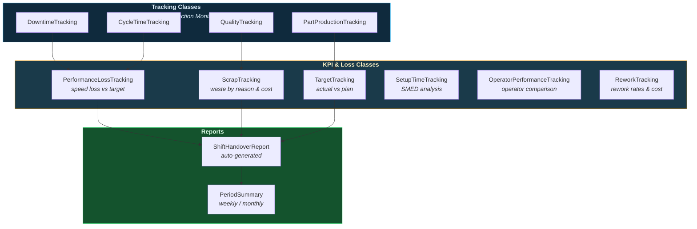

# Shift Reports & KPIs

Performance loss tracking, scrap costing, target comparison, setup time analysis (SMED), operator performance, rework tracking, and auto-generated shift handover reports.

---

## Reporting Layer

These classes sit at the top of the production analytics stack — they consume data from tracking classes and produce actionable KPIs.



---

## Performance Loss Tracking

Identify when actual cycle times fall below the target — the "Performance" factor in OEE.

```python
from ts_shape.events.production.performance_loss import PerformanceLossTracking

perf = PerformanceLossTracking(df, shift_definitions={
    "day": ("06:00", "14:00"),
    "afternoon": ("14:00", "22:00"),
    "night": ("22:00", "06:00"),
})

# Performance percentage per shift
by_shift = perf.performance_by_shift(
    cycle_uuid='cycle_trigger', target_cycle_time=30.0
)

# Identify hours where performance drops below 90%
slow = perf.slow_periods(
    cycle_uuid='cycle_trigger', target_cycle_time=30.0,
    threshold_pct=90.0, window='1h'
)

# Daily performance trend
trend = perf.performance_trend(
    cycle_uuid='cycle_trigger', target_cycle_time=30.0, window='1D'
)
```

---

## Scrap Tracking

Track material waste by shift, reason code, and monetary cost.

```python
from ts_shape.events.production.scrap_tracking import ScrapTracking

scrap = ScrapTracking(df, shift_definitions={
    "day": ("06:00", "14:00"),
    "afternoon": ("14:00", "22:00"),
    "night": ("22:00", "06:00"),
})

# Scrap quantity per shift
by_shift = scrap.scrap_by_shift(scrap_uuid='scrap_counter')

# Pareto of scrap reasons
by_reason = scrap.scrap_by_reason(
    scrap_uuid='scrap_counter', reason_uuid='scrap_reason'
)

# Convert to monetary cost
cost = scrap.scrap_cost(
    scrap_uuid='scrap_counter',
    part_id_uuid='part_number',
    material_costs={'PART_A': 12.50, 'PART_B': 8.75}
)

# Scrap trend over time
trend = scrap.scrap_trend(scrap_uuid='scrap_counter', window='1D')
```

---

## Target Tracking

Compare actual production metrics against shift or daily targets.

```python
from ts_shape.events.production.target_tracking import TargetTracking

targets = TargetTracking(df, shift_definitions={
    "day": ("06:00", "14:00"),
    "afternoon": ("14:00", "22:00"),
    "night": ("22:00", "06:00"),
})

# Actual vs target per shift
comparison = targets.compare_to_target(
    metric_uuid='part_counter',
    targets={'day': 500, 'afternoon': 500, 'night': 400}
)

# Daily target achievement summary
summary = targets.target_achievement_summary(
    metric_uuid='part_counter', daily_target=1400
)

# Target hit rate (% of days meeting target)
hit_rate = targets.target_hit_rate(
    metric_uuid='part_counter', daily_target=1400
)
```

---

## Setup Time Tracking (SMED)

Analyze changeover/setup durations for SMED (Single-Minute Exchange of Die) improvement.

```python
from ts_shape.events.production.setup_time_tracking import SetupTimeTracking

setup = SetupTimeTracking(df, shift_definitions={
    "day": ("06:00", "14:00"),
    "afternoon": ("14:00", "22:00"),
    "night": ("22:00", "06:00"),
})

# List every setup event with duration
durations = setup.setup_durations(state_uuid='machine_state', setup_value='Setup')

# Setup time by product transition (from → to)
by_product = setup.setup_by_product(
    state_uuid='machine_state', part_id_uuid='part_number'
)

# Overall setup statistics
stats = setup.setup_statistics(state_uuid='machine_state')

# Track setup time improvement over time
trend = setup.setup_trend(state_uuid='machine_state', window='1W')
```

---

## Operator Performance Tracking

Compare production output and quality across operators or teams.

```python
from ts_shape.events.production.operator_performance import OperatorPerformanceTracking

ops = OperatorPerformanceTracking(df, shift_definitions={
    "day": ("06:00", "14:00"),
    "afternoon": ("14:00", "22:00"),
    "night": ("22:00", "06:00"),
})

# Parts produced per operator
production = ops.production_by_operator(
    operator_uuid='operator_id', counter_uuid='part_counter'
)

# Operator efficiency vs target
efficiency = ops.operator_efficiency(
    operator_uuid='operator_id', counter_uuid='part_counter',
    target_per_shift=500
)

# Quality (First Pass Yield) per operator
quality = ops.quality_by_operator(
    operator_uuid='operator_id',
    ok_uuid='good_parts',
    nok_uuid='bad_parts'
)

# Ranked operator comparison
ranking = ops.operator_comparison(
    operator_uuid='operator_id', counter_uuid='part_counter'
)
```

---

## Rework Tracking

Track parts that require rework — re-processing through a station.

```python
from ts_shape.events.production.rework_tracking import ReworkTracking

rework = ReworkTracking(df, shift_definitions={
    "day": ("06:00", "14:00"),
    "afternoon": ("14:00", "22:00"),
    "night": ("22:00", "06:00"),
})

# Rework count per shift
by_shift = rework.rework_by_shift(rework_uuid='rework_counter')

# Rework by reason code
by_reason = rework.rework_by_reason(
    rework_uuid='rework_counter', reason_uuid='rework_reason'
)

# Rework rate as % of total production
rate = rework.rework_rate(
    rework_uuid='rework_counter',
    total_production_uuid='total_counter'
)

# Convert to monetary cost
cost = rework.rework_cost(
    rework_uuid='rework_counter',
    part_id_uuid='part_number',
    rework_costs={'PART_A': 5.00, 'PART_B': 3.50}
)

# Rework trend
trend = rework.rework_trend(rework_uuid='rework_counter', window='1D')
```

---

## Shift Handover Report

Auto-generate shift handover reports from raw signals — production, quality, downtime, and issues.

```python
from ts_shape.events.production.shift_handover import ShiftHandoverReport

handover = ShiftHandoverReport(df, shift_definitions={
    "day": ("06:00", "14:00"),
    "afternoon": ("14:00", "22:00"),
    "night": ("22:00", "06:00"),
})

# Generate full report from raw signals
report = handover.generate_report(
    counter_uuid='part_counter',
    ok_counter_uuid='good_parts',
    nok_counter_uuid='bad_parts',
    state_uuid='machine_state',
    targets={'day': 500, 'afternoon': 500, 'night': 400},
    quality_target_pct=98.0,
    availability_target_pct=90.0,
    report_date='2024-01-15'
)

# Highlight issues requiring attention
issues = handover.highlight_issues(
    counter_uuid='part_counter',
    ok_counter_uuid='good_parts',
    nok_counter_uuid='bad_parts',
    state_uuid='machine_state',
    report_date='2024-01-15'
)
```

### Build from pre-computed data

```python
report = ShiftHandoverReport.from_shift_data(
    production_df=production_by_shift,
    quality_df=quality_by_shift,
    downtime_df=downtime_by_shift,
    targets={'day': 500, 'afternoon': 500, 'night': 400},
    report_date='2024-01-15'
)
```

---

## Period Summary

Roll up daily data to weekly or monthly aggregations.

```python
from ts_shape.events.production.period_summary import PeriodSummary

summary = PeriodSummary(df)

# Weekly summary
weekly = summary.weekly_summary(
    counter_uuid='part_counter',
    ok_counter_uuid='good_parts',
    nok_counter_uuid='bad_parts'
)

# Monthly summary
monthly = summary.monthly_summary(
    counter_uuid='part_counter',
    ok_counter_uuid='good_parts',
    nok_counter_uuid='bad_parts'
)

# Compare two periods
comparison = summary.compare_periods(
    counter_uuid='part_counter',
    period1=('2024-01-01', '2024-01-31'),
    period2=('2024-02-01', '2024-02-29')
)
```

### Roll up from pre-computed daily data

```python
monthly = PeriodSummary.from_daily_data(
    daily_df=daily_production, freq='M', date_column='date'
)
```

---

## Next Steps

- [Production Monitoring](production.md) — The tracking classes that feed into these reports
- [OEE & Plant Analytics](oee-analytics.md) — OEE calculation from the same signals
- [Product Traceability](traceability.md) — Track individual parts through the process
- [API Reference](../reference/) — Full reporting API documentation
