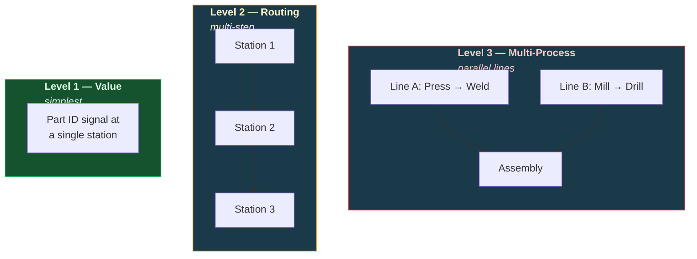
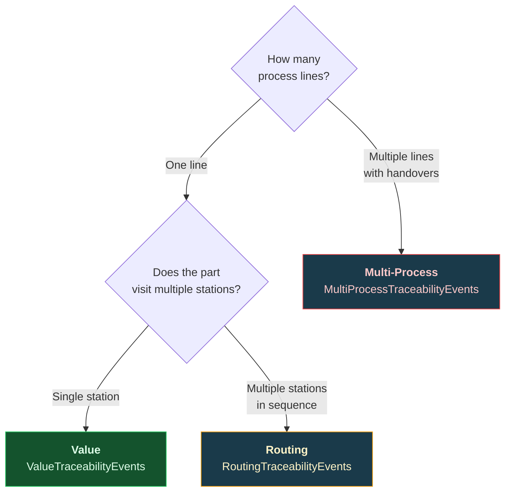

# Product Traceability

Track parts through single stations, multi-step routings, or parallel process lines. Three classes provide increasing levels of traceability complexity.

---

## Traceability Levels



| Class | Use When | Signals Required |
|-------|----------|-----------------|
| `ValueTraceabilityEvents` | Single station, one ID signal | Part ID (string) |
| `RoutingTraceabilityEvents` | Sequential stations with routing/state signal | Part ID + routing/state (integer) |
| `MultiProcessTraceabilityEvents` | Parallel lines with handovers | Multiple Part IDs + handover signals |

---

## Level 1 — Value Traceability

Track a part ID at a single station. The simplest form of traceability.

```python
from ts_shape.events.production.value_traceability import ValueTraceabilityEvents

trace = ValueTraceabilityEvents(
    dataframe=df,
    id_uuid='part_id_signal',
    station_uuids=['station_1_present', 'station_2_present'],
)

# Build timeline: when each part was at each station
timeline = trace.build_timeline()

# Lead time per part (first seen → last seen)
lead_times = trace.lead_time()

# Station dwell time statistics
station_stats = trace.station_statistics()
```

---

## Level 2 — Routing Traceability

Track parts through a sequential routing — correlate the part ID signal with a state/routing signal that indicates which step the part is at.

```python
from ts_shape.events.production.routing_traceability import RoutingTraceabilityEvents

trace = RoutingTraceabilityEvents(
    dataframe=df,
    id_uuid='part_id_signal',
    routing_uuid='routing_step_signal',
    state_map={1: 'Loading', 2: 'Processing', 3: 'Inspection', 4: 'Unloading'},
    station_map={10: 'Station A', 20: 'Station B', 30: 'Station C'},
)

# Correlate ID with routing state — full timeline
timeline = trace.build_routing_timeline()

# End-to-end lead time per item
lead_times = trace.lead_time()

# Dwell-time statistics per station/step
station_stats = trace.station_statistics()

# Routing path frequency — which sequences are most common
paths = trace.routing_paths()
```

---

## Level 3 — Multi-Process Traceability

Track parts across parallel process lines with handover events between them.

```python
from ts_shape.events.production.multi_process_traceability import MultiProcessTraceabilityEvents

trace = MultiProcessTraceabilityEvents(
    dataframe=df,
    processes=[
        {'id_uuid': 'line_a_part_id', 'station_uuids': ['press_present', 'weld_present']},
        {'id_uuid': 'line_b_part_id', 'station_uuids': ['mill_present', 'drill_present']},
        {'id_uuid': 'assembly_part_id', 'station_uuids': ['assy_present']},
    ],
    handovers=[
        {'from_id_uuid': 'line_a_part_id', 'to_id_uuid': 'assembly_part_id'},
        {'from_id_uuid': 'line_b_part_id', 'to_id_uuid': 'assembly_part_id'},
    ],
)

# Full timeline across all processes
timeline = trace.build_timeline()

# End-to-end lead time across all processes
lead_times = trace.lead_time()

# Find items processed at multiple stations simultaneously
parallel = trace.parallel_activity()

# Handover events log
handover_log = trace.handover_log()

# Station dwell statistics across all processes
station_stats = trace.station_statistics()

# Routing path frequencies
paths = trace.routing_paths()
```

---

## Choosing the Right Level



---

## Module Deep Dives

**Traceability:** [Value Traceability](../modules/production/order-traceability.md) | [Routing Traceability](../modules/production/routing-traceability.md) | [Multi-Process Traceability](../modules/production/multi-process-traceability.md)

---

## Next Steps

- [Production Monitoring](production.md) — Machine states and line throughput
- [OEE & Plant Analytics](oee-analytics.md) — Batch tracking and bottleneck analysis
- [Shift Reports & KPIs](reporting.md) — Aggregate traceability data into reports
- [API Reference](../reference/index.md) — Full traceability API documentation
