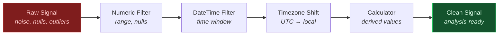

# Signal Conditioning

Clean and prepare raw plant signals before analysis. Filter noise, remove invalid readings, convert timezones, and compute derived values.

---

## Conditioning Pipeline



---

## Numeric Filtering

Remove out-of-range readings, null values, and threshold violations.

```python
from ts_shape.transform.filter.numeric_filter import NumericFilter

# Keep values within valid sensor range
df = NumericFilter.filter_value_in_range(df, "value_double", min_value=0, max_value=100)

# Remove null readings
df = NumericFilter.filter_not_null(df, "value_double")

# Keep values above alarm threshold
df = NumericFilter.filter_greater_than(df, "value_double", threshold=50)
```

---

## Time Range Filtering

Isolate data to specific production periods, shifts, or analysis windows.

```python
from ts_shape.transform.filter.datetime_filter import DateTimeFilter

# Filter to specific production period
df = DateTimeFilter.filter_between(df, "systime", "2024-01-01", "2024-01-31")

# Keep only data after commissioning date
df = DateTimeFilter.filter_after(df, "systime", "2024-06-01")

# Filter to production hours only (skip nights/weekends)
df = DateTimeFilter.filter_by_hour_range(df, "systime", start_hour=6, end_hour=22)
```

---

## String Pattern Filtering

Filter signals by UUID, machine name, or any string column.

```python
from ts_shape.transform.filter.string_filter import StringFilter

# Single signal
df = StringFilter.filter_equals(df, "uuid", "temperature")

# Pattern match (all sensors on line 1)
df = StringFilter.filter_contains(df, "uuid", "line_1_")

# Specific signal list
df = StringFilter.filter_in_list(df, "uuid", ["temp_1", "temp_2", "temp_3"])
```

---

## Boolean Flag Filtering

Filter by delta/absolute flags or any boolean column.

```python
from ts_shape.transform.filter.boolean_filter import IsDeltaFilter

# Keep only delta (incremental) values
df = IsDeltaFilter.filter_is_delta_true(df)

# Keep only absolute (snapshot) values
df = IsDeltaFilter.filter_is_delta_false(df)
```

---

## Timezone Conversion

Convert between UTC (historian) and local plant time.

```python
from ts_shape.transform.time_functions.timezone_shift import TimezoneShift
from ts_shape.transform.time_functions.timestamp_converter import TimestampConverter

# Convert Unix timestamps to datetime
df = TimestampConverter.convert_to_datetime(
    df, columns=["systime"], unit="ns", timezone="UTC"
)

# Shift to plant local time
df = TimezoneShift.shift_timezone(
    df, time_column="systime",
    input_timezone="UTC",
    target_timezone="Europe/Berlin"
)
```

---

## Derived Calculations

Compute rolling averages, differences, and normalized values.

```python
from ts_shape.transform.calculator.numeric_calc import NumericCalc

# Rolling average (smooth noisy signals)
df = NumericCalc.add_rolling_mean(df, "value_double", window=10)

# Rate of change
df = NumericCalc.add_diff(df, "value_double")

# Normalize to 0-1 scale
df = NumericCalc.normalize(df, "value_double")
```

---

## Custom Filtering with Query Syntax

Combine multiple conditions using pandas query syntax.

```python
from ts_shape.transform.filter.custom_filter import CustomFilter

# Multi-condition filter
df = CustomFilter.filter_custom_conditions(
    df, "value_double > 50 and value_double < 100 and uuid == 'temperature'"
)
```

---

## Lambda Processing

Apply arbitrary transformations to any column.

```python
from ts_shape.transform.functions.lambda_func import LambdaProcessor
import numpy as np

# Log transform
df = LambdaProcessor.apply_function(df, "value_double", lambda x: np.log1p(x))

# Z-score normalization
df = LambdaProcessor.apply_function(
    df, "value_double", lambda x: (x - x.mean()) / x.std()
)

# Clip to valid operating range
df = LambdaProcessor.apply_function(df, "value_double", lambda x: np.clip(x, 0, 100))
```

---

## Module Deep Dives

**Energy:** [Consumption Analysis](../modules/energy/consumption-analysis.md) | [Efficiency Tracking](../modules/energy/efficiency-tracking.md)

**Maintenance:** [Degradation Detection](../modules/maintenance/degradation-detection.md) | [Failure Prediction](../modules/maintenance/failure-prediction.md) | [Vibration Analysis](../modules/maintenance/vibration-analysis.md)

---

## Next Steps

- [Signal Analytics](statistics.md) — Compute statistics on conditioned signals
- [Quality Control & SPC](quality.md) — Detect outliers and process shifts
- [API Reference](../reference/index.md) — Full transform API documentation
