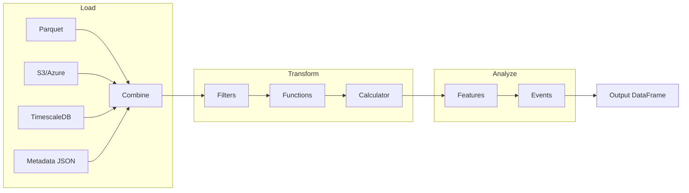

---
hide:
  - navigation
  - toc
---

<style>
.md-typeset h1 {
  display: none;
}
</style>

<div align="center" markdown>

# **ts-shape**

### Timeseries Shaper

[](https://pypi.org/project/ts-shape/)
[](https://pepy.tech/projects/ts-shape)
[](https://pypi.org/project/ts-shape/)
[](license.md)

**A lightweight, composable toolkit to load, shape, and analyze time series data.**

[Get Started](user_guide/installation.md){ .md-button .md-button--primary }
[API Reference](reference/SUMMARY.md){ .md-button }

</div>

---

## Why ts-shape?

<div class="grid cards" markdown>

-   :material-lightning-bolt:{ .lg .middle } **DataFrame-First**

    ---

    Every operation accepts and returns Pandas DataFrames. No proprietary formats, no lock-in. Just simple, composable data pipelines.

-   :material-puzzle:{ .lg .middle } **Modular Design**

    ---

    Use only what you need. Loaders, transforms, features, and event detectors are fully decoupled and independently usable.

-   :material-cloud-sync:{ .lg .middle } **Multi-Source Loading**

    ---

    Load from local Parquet, S3, Azure Blob Storage, or TimescaleDB with a unified interface. Mix and match as needed.

-   :material-chart-timeline-variant:{ .lg .middle } **Production Ready**

    ---

    Built-in support for cycle detection, quality events, downtime tracking, and production analytics.

</div>

---

## Quick Start

### Installation

```bash
pip install ts-shape
```

Optional dependencies for specific backends:

```bash
# Parquet engine (recommended)
pip install pyarrow

# Azure Blob Storage
pip install azure-storage-blob

# TimescaleDB
pip install sqlalchemy psycopg2-binary
```

### Basic Usage

```python
import pandas as pd
from ts_shape.transform.filter.numeric_filter import NumericFilter
from ts_shape.features.stats.numeric_stats import NumericStatistics

# Load your timeseries data
df = pd.read_parquet("sensor_data.parquet")

# Filter values within range
filtered = NumericFilter.filter_value_in_range(
    df, column="value_double", min_value=0, max_value=100
)

# Compute statistics
stats = NumericStatistics(filtered, column="value_double")
print(f"Mean: {stats.mean()}, Std: {stats.std()}")
```

---

## Architecture



---

## Core Modules

<div class="grid" markdown>

<div markdown>

### :material-database-import: Loaders

Load timeseries and metadata from multiple sources:

- **Parquet** - Local and remote parquet files
- **S3 Proxy** - S3-compatible storage via `s3fs`
- **Azure Blob** - Time-partitioned container layouts
- **TimescaleDB** - Chunked reads with parquet export
- **Metadata JSON** - Flexible JSON ingestion

</div>

<div markdown>

### :material-filter: Transforms

Clean and reshape your data:

- **Numeric Filter** - Range, threshold, null handling
- **String Filter** - Pattern matching, contains, regex
- **DateTime Filter** - Time range, weekday, hour filters
- **Boolean Filter** - Flag-based filtering
- **Calculator** - Derived columns, rolling windows

</div>

<div markdown>

### :material-chart-box: Features

Extract summary statistics:

- **Numeric Stats** - min, max, mean, std, percentiles
- **Time Stats** - coverage, gaps, frequency analysis
- **String Stats** - value counts, cardinality
- **Cycle Detection** - Identify repeating patterns

</div>

<div markdown>

### :material-alert-circle: Events

Detect domain-specific patterns:

- **Quality** - Outliers, SPC rules, tolerance deviation
- **Production** - Cycle times, downtime, throughput
- **Engineering** - Startup events, setpoint changes
- **Maintenance** - Operational event detection

</div>

</div>

---

## Data Model

ts-shape uses a simple, consistent schema:

| Column | Type | Description |
|--------|------|-------------|
| `uuid` | string | Unique signal/series identifier |
| `systime` | datetime | Timestamp (tz-aware recommended) |
| `value_double` | float | Numeric value channel |
| `value_integer` | int | Integer value channel |
| `value_string` | string | String value channel |
| `value_bool` | bool | Boolean value channel |

!!! tip "Flexible Schema"
    Not all columns are required. Use only the value channels relevant to your data.

---

## Example Pipeline

```python
from ts_shape.loader.timeseries.parquet_loader import ParquetLoader
from ts_shape.loader.metadata.metadata_json_loader import MetadataLoader
from ts_shape.loader.combine.integrator import DataIntegratorHybrid
from ts_shape.transform.filter.datetime_filter import DateTimeFilter
from ts_shape.features.stats.numeric_stats import NumericStatistics
from ts_shape.events.quality.outlier_detection import OutlierDetection

# 1. Load data
ts_df = ParquetLoader("data/sensors/").load()
meta_df = MetadataLoader("config/metadata.json").to_df()

# 2. Combine timeseries with metadata
combined = DataIntegratorHybrid.combine_data(
    timeseries_sources=[ts_df],
    metadata_sources=[meta_df],
    join_key="uuid"
)

# 3. Filter to time range
filtered = DateTimeFilter.filter_after(
    combined, column="systime", date="2024-01-01"
)

# 4. Detect outliers
outliers = OutlierDetection.detect_zscore_outliers(
    filtered, column="value_double", threshold=3.0
)

# 5. Compute statistics on clean data
clean = filtered[~filtered.index.isin(outliers.index)]
stats = NumericStatistics(clean, column="value_double")
```

---

<div class="grid cards" markdown>

-   :material-book-open-variant:{ .lg .middle } **Concept Guide**

    ---

    Deep dive into ts-shape's architecture and design principles.

    [:octicons-arrow-right-24: Read the concept guide](concept.md)

-   :material-api:{ .lg .middle } **API Reference**

    ---

    Complete API documentation for all modules.

    [:octicons-arrow-right-24: Browse the API](reference/SUMMARY.md)

-   :material-factory:{ .lg .middle } **Production Modules**

    ---

    Specialized tools for manufacturing analytics.

    [:octicons-arrow-right-24: Explore production](production/overview.md)

-   :material-github:{ .lg .middle } **Source Code**

    ---

    View the source, report issues, or contribute.

    [:octicons-arrow-right-24: GitHub](https://github.com/jakobgabriel/ts-shape)

</div>

---

<div align="center" markdown>

**MIT License** - Made with :material-heart: for the timeseries community

</div>
