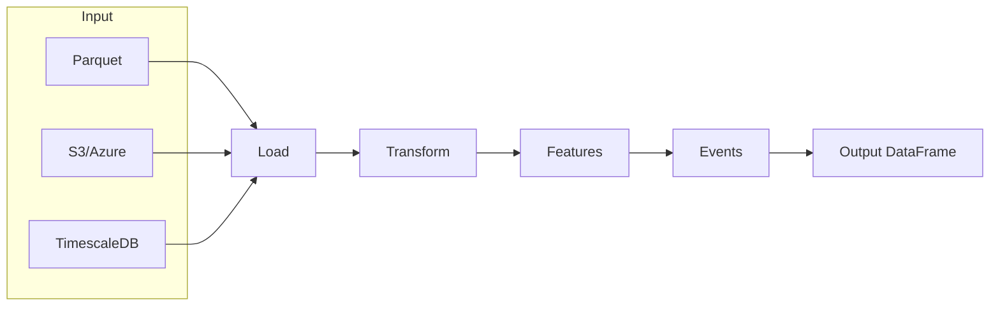

---
hide:
  - navigation
  - toc
---

<style>
.md-typeset h1 {
  display: none;
}
</style>

<div align="center" markdown>

# **ts-shape**

### Shape Your Timeseries Data

[](https://pypi.org/project/ts-shape/)
[](https://pepy.tech/projects/ts-shape)
[](https://pypi.org/project/ts-shape/)
[](license.md)

**Load, transform, and analyze timeseries data with a clean, composable API.**

[Get Started](user_guide/installation.md){ .md-button .md-button--primary }
[Usage Examples](usage/index.md){ .md-button }

</div>

---

## Why ts-shape?

<div class="grid cards" markdown>

-   :material-lightning-bolt:{ .lg .middle } **DataFrame-First**

    ---

    Every operation accepts and returns Pandas DataFrames. No proprietary formats, no lock-in.

-   :material-puzzle:{ .lg .middle } **Modular Design**

    ---

    Use only what you need. Loaders, transforms, features, and events are fully decoupled.

-   :material-cloud-sync:{ .lg .middle } **Multi-Source Loading**

    ---

    Load from Parquet, S3, Azure Blob, or TimescaleDB with a unified interface.

-   :material-chart-timeline-variant:{ .lg .middle } **Analysis Ready**

    ---

    Built-in statistics, cycle detection, outlier detection, and event extraction.

</div>

---

## Quick Example

```python
import pandas as pd
from ts_shape.transform.filter.numeric_filter import NumericFilter
from ts_shape.features.stats.numeric_stats import NumericStatistics

# Load your data
df = pd.read_parquet("sensors.parquet")

# Filter to valid range
clean = NumericFilter.filter_value_in_range(df, "value_double", 0, 100)

# Get statistics
stats = NumericStatistics(clean, "value_double")
print(f"Mean: {stats.mean():.2f}, Std: {stats.std():.2f}")
```

---

## Architecture



---

## Core Modules

<div class="grid" markdown>

<div markdown>

### :material-database-import: Loaders

- **Parquet** - Local and remote files
- **S3 Proxy** - S3-compatible storage
- **Azure Blob** - Container layouts
- **TimescaleDB** - SQL timeseries
- **Metadata JSON** - Context enrichment

</div>

<div markdown>

### :material-filter: Transforms

- **Numeric Filter** - Range, threshold
- **String Filter** - Pattern matching
- **DateTime Filter** - Time ranges
- **Boolean Filter** - Flag filtering
- **Calculator** - Derived columns

</div>

<div markdown>

### :material-chart-box: Features

- **Numeric Stats** - min, max, mean, std
- **Time Stats** - Coverage, gaps
- **String Stats** - Value counts
- **Cycles** - Pattern detection

</div>

<div markdown>

### :material-alert-circle: Events

- **Quality** - Outliers, SPC
- **Engineering** - Setpoints, startup
- **Production** - Cycles, downtime

</div>

</div>

---

## Data Model

ts-shape uses a simple schema:

| Column | Type | Description |
|--------|------|-------------|
| `uuid` | string | Signal identifier |
| `systime` | datetime | Timestamp |
| `value_double` | float | Numeric values |
| `value_integer` | int | Integer values |
| `value_string` | string | String values |
| `value_bool` | bool | Boolean values |

!!! tip "Flexible"
    Use only the columns you need. Not all are required.

---

<div class="grid cards" markdown>

-   :material-book-open-variant:{ .lg .middle } **Concept**

    ---

    Architecture and design principles.

    [:octicons-arrow-right-24: Learn more](concept.md)

-   :material-code-tags:{ .lg .middle } **Usage**

    ---

    Practical examples and patterns.

    [:octicons-arrow-right-24: See examples](usage/index.md)

-   :material-api:{ .lg .middle } **API Reference**

    ---

    Complete API documentation.

    [:octicons-arrow-right-24: Browse API](reference/)

-   :material-github:{ .lg .middle } **GitHub**

    ---

    Source code and issues.

    [:octicons-arrow-right-24: View source](https://github.com/jakobgabriel/ts-shape)

</div>

---

<div align="center" markdown>

**MIT License** - Built for the timeseries community

</div>
